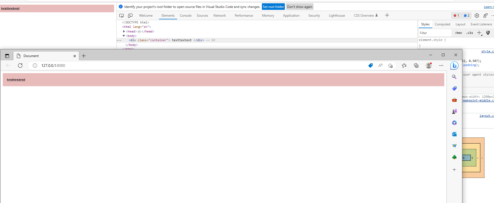

## Approach
Before importing style.css:
```html
<link rel="stylesheet" href="layout.css">
<link rel="stylesheet" href="breakpoint-middle.css" media="only screen and (max-width: 1280px)">
```
## Result
